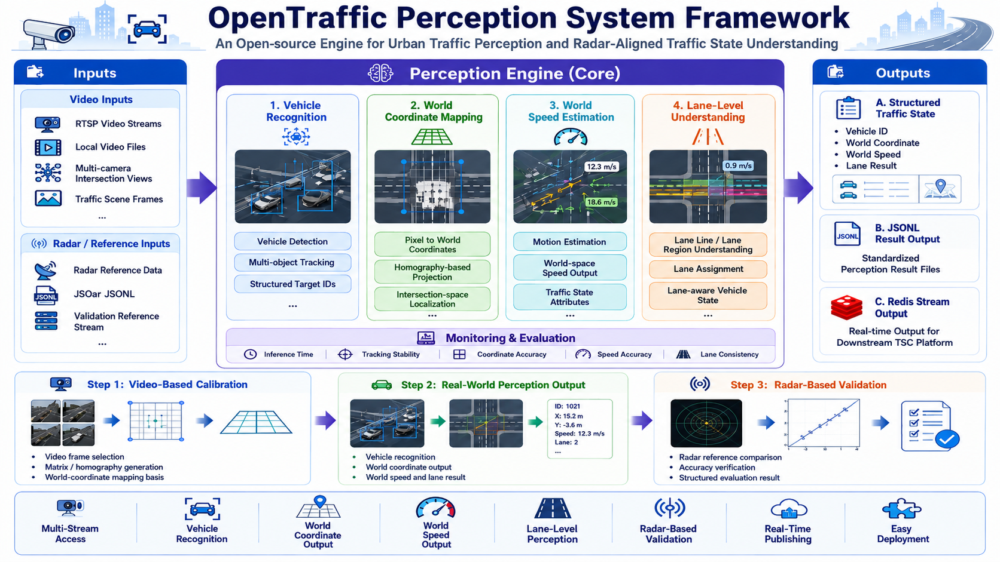

<div align="right">

[**English**](README.md) | [**中文**](README_ZH.md)

</div>

<div align="center">
  

[](LICENSE)
[](https://www.python.org/)
[]()

<br/>

[](https://huggingface.co/OpenTraffic-Team)
[](https://github.com/OpenTraffic-Team/Tir)
[](https://github.com/OpenTraffic-Team/Tir/issues/1)

</div>

### TIR — Open-source traffic perception engine for urban intersections

Supports multi-stream RTSP input, YOLO11 + DeepSort detection and tracking, homography-based coordinate transformation, world velocity estimation, lane-level structured output, and radar-reference validation. Designed for Perception-Driven TSC scenarios.

<div align="center">
  
</div>

## 🌟 Table of Contents

- [:clapper: Demo Video](#clapper-demo-video)
- [:loudspeaker: News](#loudspeaker-news)
- [:clipboard: TODO List](#clipboard-todo-list)
- [:rocket: Quick Start](#rocket-quick-start)
  - [Environment Requirements](#environment-requirements)
  - [Installation](#installation)
  - [Start Redis](#start-redis)
  - [Prepare Video Streams](#prepare-video-streams)
  - [Start the System](#start-the-system)
- [:pencil: Configuration](#pencil-configuration)
  - [Camera Fields](#camera-fields)
  - [Global Fields](#global-fields)
  - [Example](#example)
- [:sparkles: Features](#sparkles-features)
- [:package: .so Delivery Version](#package-so-delivery-version)
- [:database: Redis Data Format](#database-redis-data-format)
- [:bar_chart: Performance](#bar_chart-performance)
- [:book: Paper](#book-paper)
- [:hugs: Hugging Face](#hugs-hugging-face)
- [:earth_asia: Social Media](#earth_asia-social-media)
- [:bookmark: Citation](#bookmark-citation)
- [:page_facing_up: License](#page_facing_up-license)

<br/>

## :clapper: Demo Video

[](videos/perception_raw.mp4)

<br/>

## :loudspeaker: News

- **[2026/05/27]** Restructured README to align with unified English homepage style.
- **[2026/05/15]** Initial release of TIR, supporting real-time multi-direction intersection perception.

<br/>

## :clipboard: TODO List

- [x] YOLO11 + DeepSort detection and tracking pipeline
- [x] Four-direction (E/S/W/N) data fusion
- [x] Homography matrix pixel → radar world coordinate transformation
- [x] Real-time Redis Stream writing
- [x] Hungarian algorithm cross-modal ID matching (vision ↔ radar)
- [x] In-frame OCR timestamp extraction
- [x] Lane-level structured output
- [x] Radar-reference validation pipeline
- [ ] Release pretrained model weights to HuggingFace
- [ ] Support more intersection configurations
- [ ] Publish technical report / ArXiv paper
- [ ] Web visualization dashboard
- [ ] Support more camera protocols

<br/>

## :rocket: Quick Start

### Environment Requirements

| Item | Requirement |
|---|---|
| OS | Linux x86_64 |
| NVIDIA Driver | ≥ 560 |
| CUDA | 12.6 |
| Python | 3.13+ |
| PyTorch | 2.11.0+cu126 |

### Installation

```bash
# Clone the repository
git clone https://github.com/OpenTraffic-Team/opentraffic-perception-engine.git
cd opentraffic-perception-engine-main/opentraffic-TIR

# Install dependencies
pip install -r requirements.txt
```

### Start Redis

```bash
redis-server redis.conf
```

### Prepare Video Streams

**Use mediamtx to serve local video as RTSP:**

```bash
./mediamtx mediamtx.yml
```

**Or use VLC to stream:**

```bash
vlc video.mp4 --sout '#rtp{sdp=rtsp://:8554/test}'
```

**Or use a local video path directly:** Set the `rtsp_url` field in `drivers/config.json` to a local file path (e.g. `input/45_0429.mp4`).

> Test video: https://pan.baidu.com/s/1qULF2WcxUP_l5Cvs9uV-JA  Password: 1234

### Start the System

```bash
./run_local.sh
```

Stop:

```bash
./stop_local.sh
```

<br/>

## :pencil: Configuration

Edit `opentraffic-TIR/drivers/config.json`.

### Camera Fields

| Field | Type | Description |
|---|---|---|
| `id` | string | Camera ID, format: `{intersection_id}_{direction}` |
| `rtsp_url` | string | RTSP URL or local video file path |
| `window` | `[x1, y1, x2, y2]` | Detection crop window; use `[0, 0, 1920, 1080]` for full frame |
| `H` | 3×3 matrix | Pixel → radar homography matrix |
| `H_inv` | 3×3 matrix | Radar → pixel inverse matrix (auto-computed from H if omitted) |
| `radar_variant` | string | Coordinate variant, default `"default"` |
| `radar_redis_key` | string | Redis key for this camera's output |

### Global Fields

| Field | Description |
|---|---|
| `debugMode` | Enable verbose tracking logs |
| `jsonlOutputDir` | JSONL output directory |
| `radarReferenceJsonl` | Radar reference file for validation |
| `matchTargetDir` | Radar JSON output directory for cross-modal ID matching |
| `matchTimeMaxDeltaMs` | Max timestamp matching tolerance (ms) |
| `vehicleMatchMaxDist` | Max vehicle center matching distance (meters) |
| `localRedisConfig.host` | Redis server address |
| `localRedisConfig.password` | Redis password |
| `data_processing.upload_interval_sec` | JSON merge and upload interval (seconds) |

### Example

```json
{
  "intersection": {
    "id": "HHL_QHDD",
    "name": "Honghua Road",
    "cameras": [
      {
        "id": "HHL_QHDD_S",
        "rtsp_url": "./input/45_0429.mp4",
        "window": [0, 0, 1920, 1080],
        "H": [[...], [...], [...]],
        "H_inv": [[...], [...], [...]],
        "radar_variant": "default",
        "radar_redis_key": "origin_info_state:HHL_QHDD"
      }
    ]
  },
  "debugMode": false,
  "jsonlOutputDir": "./control_group_fullspeed_jsonl",
  "radarReferenceJsonl": "./reference_radar/HHL_QHDD_S/HHL_QHDD_S_shard_00000.jsonl",
  "vehicleMatchMaxDist": 10.0,
  "localRedisConfig": {
    "host": "127.0.0.1",
    "port": 6379,
    "db": 0,
    "password": "your_password"
  },
  "data_processing": {
    "upload_interval_sec": 1
  }
}
```

<br/>

## :sparkles: Features

### :oncoming_automobile: Vehicle Detection

- Vehicle detection and multi-object tracking (YOLO11 + DeepSort) for intersection video.
- Compatible with RTSP streams and local video files.
- Recognition engine compiled to `.so` for acceleration; outputs structured target IDs for downstream use.

### :world_map: World Coordinate Output

- Projects image-space targets into world coordinates.
- Uses calibrated homography matrix (H / H_inv) for pixel-to-world mapping.
- Outputs radar-style coordinates for downstream integration.

### :dash: World Velocity Estimation

- Kalman-filter-based `SimpleVelocityEstimator` estimates target velocity in world coordinates.
- Outputs structured velocity fields (m/s) per tracked vehicle.
- Supports traffic state interpretation and speed comparison against radar reference.

### :motorway: Lane-Level Output

- Associates detected targets with lane semantics.
- Generates lane-level structured results for consumption by control systems.

### :clock1: Timestamp Extraction

- OCR extracts timestamps from video frames for accurate temporal alignment.

### :link: Cross-Modal ID Matching

- Hungarian algorithm aligns visual targets with external radar data by ID.

<br/>

## :package: .so Delivery Version

This section applies to the self-contained `.so` delivery package, which runs without the full source code.

### Included Resources

| Resource | Path |
|---|---|
| Input video | `input/45_0429.mp4` |
| Radar reference data | `reference_radar/HHL_QHDD_S/HHL_QHDD_S_shard_00000.jsonl` |
| Python environment | `.venv` |
| Start script | `run_local.sh` |
| Stop script | `stop_local.sh` |

### Running

Start:

```bash
cd /tir-0513-git-so
./run_local.sh
```

Stop:

```bash
cd /tir-0513-git-so
./stop_local.sh
```

### Output Format

Default output directory:

```text
control_group_fullspeed_jsonl/HHL_QHDD_S/HHL_QHDD_S_shard_00000.jsonl
```

Output JSONL fields:

| Field | Description |
|---|---|
| `timestamp_ms` | Frame timestamp (milliseconds) |
| `intersection_id` | Intersection ID |
| `camera_id` | Camera ID |
| `source` | Data source |
| `coordinate_space` | Coordinate space |
| `vehicles[].id` | Vehicle ID |
| `vehicles[].center` | Vehicle center coordinates (meters) |
| `vehicles[].speed` | Velocity vector (m/s) |
| `vehicles[].speed_scalar` | Speed scalar (m/s) |
| `vehicles[].lane` | Lane |
| `vehicles[].type` | Vehicle type |

<br/>

## :database: Redis Data Format

Results are written to two Redis keys:

- **Snapshot**: `recognition_{camera_id}_snap`
- **Stream**: `recognition_{camera_id}`

Merged four-direction snapshot format (`origin_info_state:{intersection_id}`):

```json
{
  "code": "HHL_QHDD",
  "name": "Honghua Road",
  "recognitionSnap[HHL_QHDD_E]": {
    "timestamp": 1734400000.0,
    "vehicles": [
      {
        "id": "42",
        "orig_id": "7",
        "type": "",
        "lane": "",
        "center": [12.5, 8.3],
        "speed": [3.2, -1.1],
        "licenseNum": ""
      }
    ]
  }
}
```

| Field | Description |
|---|---|
| `timestamp` | Frame timestamp in seconds (extracted via OCR) |
| `id` | Target ID after radar matching |
| `orig_id` | Original visual tracking ID (before matching) |
| `center` | World coordinates `[x, y]` in meters |
| `speed` | Velocity components `[vx, vy]` in m/s |
| `type` | Vehicle type (if available) |
| `licenseNum` | License plate number (if available) |

<br/>

## :bar_chart: Performance

> Evaluation: historical full-set speed JSONL vs. raw radar JSONL.

### Field Error Comparison

| Field | Mean | Median (p50) | p75 | p90 | Notes |
|---|---|---|---|---|---|
| `timestamp_ms` error (ms) | 25.04 | 26.5 | 37 | 46 | Time delta between video frame and nearest radar frame |
| `vehicles[].center` error (m) | 2.5132 | 1.6251 | 3.1987 | 6.7021 | Spatial position error of matched targets |
| `vehicles[].speed_scalar` error (m/s) | 1.6727 | 0.3176 | 1.7741 | 5.0061 | Speed scalar error of matched targets |

### Field Consistency

| Field | Comparison | Consistency |
|---|---|---|
| `intersection_id` | Exact match | **100%** |
| `camera_id` | Exact match | **100%** |
| `coordinate_space` | Exact match | **100%** |
| `timestamp_ms` | Aligned within 200ms | **100%** |
| `vehicles[].lane` | Exact match with radar | **100%** |

<br/>

## :book: Paper

- Title: `OpenTraffic Perception System for Perception-Driven TSC`
- Status: `In preparation / pending release`

<br/>

## :hugs: Hugging Face

- Model page: `https://huggingface.co/OpenTraffic-Team`
- Planned releases:
  - Packaged perception model
  - Sample output results
  - Benchmark examples

<br/>

## :earth_asia: Social Media

- GitHub: `https://github.com/OpenTraffic-Team/Tir`
- WeChat Group: [Join Discussion](https://github.com/OpenTraffic-Team/Tir/issues/1)
- X / Twitter: `Coming soon`

<br/>


## :page_facing_up: License

This project is released under the [Apache 2.0 License](LICENSE).

---

<div align="center">
  <b>OpenTraffic Team</b> | Making urban traffic smarter.
</div>
